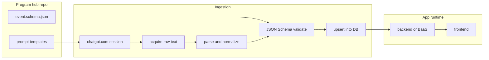
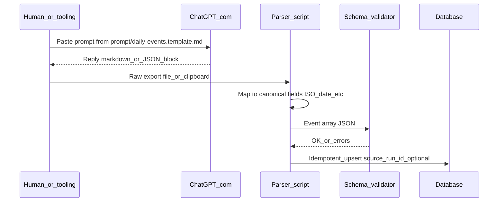

# Data pipeline: ChatGPT.com → database → frontend

This product builds a **proprietary event database**. Research and drafting use **chatgpt.com** (browser UI, including web search when enabled), **not** the OpenAI HTTP API. The pipeline is: prompt → acquire text → parse → normalize → validate → load → serve to the client.

## High-level flow

## Sequence (operational)

## Steps

1. **Prompt** — Use a fixed template ([prompt/daily-events.template.md](../prompt/daily-events.template.md)) so every run requests the same scope, categories, volume (3–5 per category), sort order (newest first), and **field names** aligned with [schema/event.schema.json](../schema/event.schema.json).
2. **Acquisition** — Capture the model reply (copy/paste, export, or internal automation). Document the **one blessed method** in [prompt/README.MD](../prompt/README.MD) so the team does not diverge.
3. **Parse** — Convert model output into an array of objects. Normalize **`date` to `YYYY-MM-DD`**. Drop or migrate ingest-only strings (for example `4月20日`, `2004年`) into canonical fields or discard after validation.
4. **Validate** — Run [schema/event.schema.json](../schema/event.schema.json) on each record before load.
5. **Load** — Upsert into the production database. Use an optional **`source_run_id`** (or batch id) so re-ingesting the same calendar day is idempotent and auditable.

## Risks (automation and compliance)

- **Terms of service**: Automated scraping of chatgpt.com may conflict with OpenAI’s terms; treat **manual export + parser** as the default reliable path and seek legal review before unattended scraping.
- **Brittleness**: UI and HTML structure change; parsers tied to DOM break without warning.
- **Quality**: Hallucinations and wrong dates require human or scripted QA, especially for history content.

## Frontend contract

The client loads **canonical JSON** from your API (or static bundles generated from the same validated pipeline). It should not depend on raw ChatGPT markdown at runtime.
