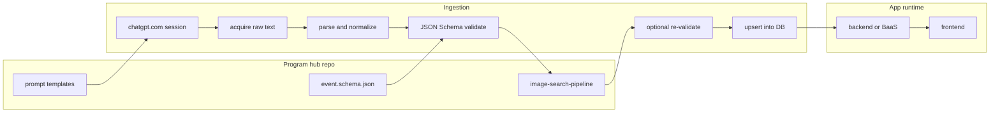
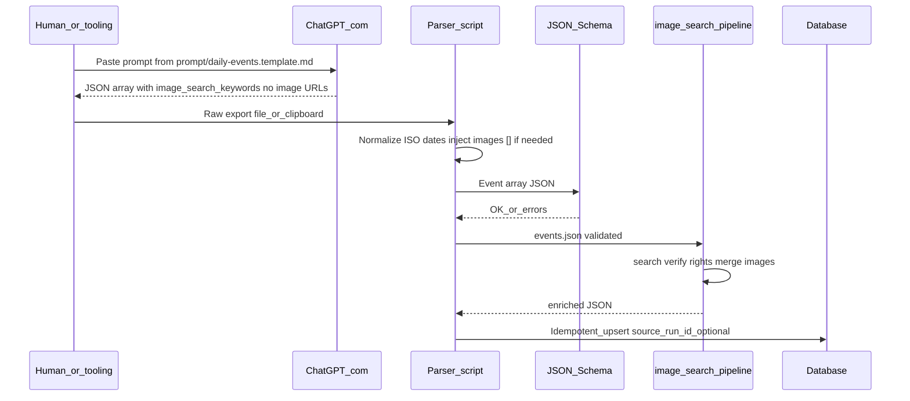

# Data pipeline: ChatGPT.com → image search → database → frontend

This product builds a **proprietary highlight database** (events, birthdays, culture hooks, and similar “on this day” content). **Editorial text** is drafted with **chatgpt.com** (browser UI, with web search). **Images are not produced by ChatGPT**; instead the model outputs **`image_search_keywords`**, and the **[`image-search-pipeline/`](../image-search-pipeline/)** sub-project (or equivalent tooling) resolves those into **`images`** URLs before or at load time. The HTTP API is **not** required for the ChatGPT ingest step.

## High-level flow

`Val2` can be the same schema pass once `images` is filled, or a stricter contract if you split “text ingest” vs “shippable record” schemas in tooling.

## Sequence (operational)

## Steps

1. **Prompt** — Use [prompt/daily-events.template.md](../prompt/daily-events.template.md): engagement-focused copy, **`image_search_keywords` only** for media (no URLs). Field names align with [schema/event.schema.json](../schema/event.schema.json).
2. **Acquisition** — Capture the model reply (copy/paste, export, or approved automation). Document the **one blessed method** in [prompt/README.MD](../prompt/README.MD).
3. **Parse** — Normalize **`date` to `YYYY-MM-DD`**. If the model omitted `images`, add **`"images": []`** before validation. Map legacy fields if migrating older files.
4. **Validate (text)** — Run JSON Schema on each record; **`image_search_keywords` is required** at this stage.
5. **Image pipeline** — Run [image-search-pipeline/run.py](../image-search-pipeline/run.py) with **`--search`**: resolves **`image_search_keywords`** via Wikimedia Commons + Openverse HTTP APIs and writes **`images`** (see [image-search-pipeline/README.md](../image-search-pipeline/README.md)). Swap in commercial image-search APIs here if you need stricter relevance.
6. **Load** — Upsert into the database. Use **`source_run_id`** (or batch id) for idempotent re-ingestion and to tie text runs to image runs.

## Risks (automation and compliance)

- **Terms of service**: Automated scraping of chatgpt.com may conflict with OpenAI’s terms; treat **manual export + parser** as the default reliable path and seek legal review before unattended scraping.
- **Image providers**: Third-party image search APIs have their own terms, quotas, and attribution requirements—document them beside the pipeline implementation.
- **Brittleness**: UI and HTML structure change; parsers tied to DOM break without warning.
- **Quality**: Hallucinations and wrong dates require human or scripted QA, especially for history content.

## Frontend contract

The client loads **canonical JSON** from your API (or static bundles). It should not depend on raw ChatGPT markdown at runtime. **`images`** should only ship URLs that the pipeline has verified (or your CDN paths after download).
